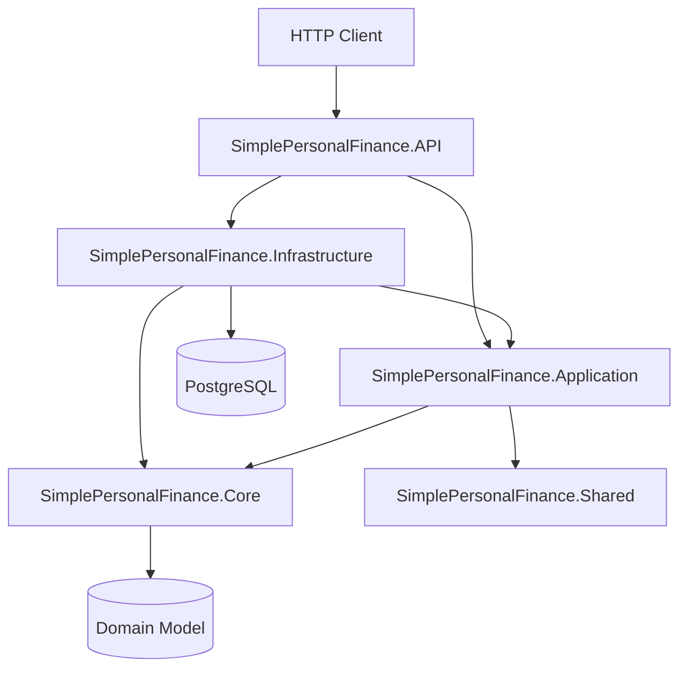

# Simple Personal Finance

[](https://github.com/caiodom/simple-personal-finance/actions/workflows/dotnet-ci.yml)

A personal-finance REST API built with .NET 10 and PostgreSQL. The project is intentionally small enough to understand end to end, while still demonstrating production-oriented engineering practices around architecture, security, persistence, observability, automated testing, Docker, and CI.

> This is a learning and portfolio project, not an audited financial product or a production banking system.

## Highlights

- **.NET 10 / ASP.NET Core Web API**
- **Entity Framework Core 10 + PostgreSQL 17**
- **CQRS with MediatR** and FluentValidation
- **DDD-inspired domain model** with aggregates and domain events
- **JWT Bearer authentication** with per-user resource ownership checks
- **PBKDF2-HMAC-SHA256 password hashing** with random salts and 600,000 iterations
- **RFC-style Problem Details** for centralized exception handling
- **Serilog + Seq** structured observability without logging command/query payloads
- **Explicit database migrations** instead of schema mutation during normal application startup
- **Transactional domain-event dispatch** for in-process consistency
- **Liveness and readiness probes**, including PostgreSQL connectivity
- **Docker Compose** with PostgreSQL, migration job, API, Nginx TLS proxy, and Seq
- **Testcontainers-based PostgreSQL integration tests** using the real Npgsql provider and real migrations
- **Executable architecture tests** that protect project-layer dependencies
- **Hardened GitHub Actions CI** with dependency audit, warnings-as-errors, formatting checks, coverage, Docker build, and Compose validation

## Architecture

The solution follows a layered architecture with explicit dependency boundaries.



### Projects

| Project | Responsibility |
| --- | --- |
| `SimplePersonalFinance.Core` | Domain entities, value objects, domain events, exceptions, and core abstractions |
| `SimplePersonalFinance.Application` | Commands, queries, handlers, validation, view models, and application behavior |
| `SimplePersonalFinance.Infrastructure` | EF Core/Npgsql persistence, repositories, migrations, authentication, and external implementation details |
| `SimplePersonalFinance.API` | HTTP controllers, authentication pipeline, exception handling, middleware, Swagger, health endpoints, and composition root |
| `SimplePersonalFinance.Shared` | Small framework-independent shared contracts such as pagination results |
| `SimplePersonalFinance.Test` | Unit, integration, security, persistence, health, and architecture tests |

Architecture tests enforce the important dependency rules at build time:

- Core must not depend on Application, Infrastructure, or API.
- Shared must remain independent from application layers.
- Application must not depend on Infrastructure or API.
- Infrastructure must not depend on API.

## Security Model

### Authentication

The API uses JWT Bearer authentication. Public authentication endpoints are:

- `POST /api/users/register`
- `POST /api/users/login`

Authenticated requests use the user identifier from the JWT claims rather than trusting a user id supplied by the client.

### Object-level authorization

Accounts, budgets, transactions, and user data are checked against the authenticated user before being returned or modified. Requests for resources owned by another user use not-found semantics so the API does not disclose whether another user's resource exists.

### Password storage

Passwords are never stored directly. Password hashes use:

- PBKDF2
- HMAC-SHA256
- random 16-byte salt
- 600,000 iterations
- fixed-time hash comparison

### Secrets

Secrets are not stored in tracked `appsettings` files. Use:

- `.NET user-secrets` for local API development
- `infra/.env` for Docker Compose
- environment variables in deployed environments

The tracked `infra/.env.example` contains placeholders only.

## Persistence

PostgreSQL is the source of truth. EF Core migrations are versioned in the repository.

Important database-level protections include:

- unique user e-mail
- one active budget per user/category
- transaction indexes optimized for account/activity/date access patterns
- `BirthdayDate` stored as PostgreSQL `date`, not a timestamp

Repositories do not expose `IQueryable` outside Infrastructure. Query materialization and provider-specific operations stay inside the persistence layer.

## Domain Events and Consistency

In-process domain events participate in the same EF Core transaction as the state change that produced them:

1. changes are written inside an explicit database transaction;
2. domain events are dispatched before commit;
3. the transaction commits only if persistence and event handling succeed;
4. domain events are cleared only after a successful commit.

This keeps internal domain handlers atomic without introducing a message broker or outbox where the current scope does not require one.

## Running the Full Docker Stack

### Prerequisites

- Docker Engine or Docker Desktop
- Docker Compose v2

### 1. Configure local secrets

From the repository root:

```bash
cd infra
cp .env.example .env
```

Edit `infra/.env` and replace the placeholder values:

```dotenv
POSTGRES_USER=spfuser
POSTGRES_PASSWORD=replace-with-a-strong-local-password
POSTGRES_DB=spfdb
JWT_KEY=replace-with-a-random-secret-at-least-32-characters-long
```

Never commit the real `.env` file.

### 2. Start the stack

```bash
docker compose up --build -d
```

The startup sequence is dependency-aware:

1. PostgreSQL starts and becomes healthy.
2. `spf-migrate` applies EF Core migrations and exits successfully.
3. The API starts.
4. The API readiness probe verifies PostgreSQL connectivity.
5. Nginx starts only after the API is healthy.

### 3. Open the application endpoints

- API / Swagger: `https://localhost/swagger`
- Readiness: `https://localhost/api/health/ready`
- Liveness: `https://localhost/api/health/live`
- Seq: `http://localhost:5341`

Nginx uses a locally generated self-signed certificate, so your browser may display a certificate warning during local development.

### 4. Stop the stack

```bash
docker compose down
```

To also remove the local PostgreSQL volume and reset all data:

```bash
docker compose down -v
```

> `down -v` permanently deletes the local database volume.

## Local API Development

Use this mode when you want PostgreSQL/Seq/Adminer in Docker but run the API directly with the .NET SDK.

### Prerequisites

- .NET 10 SDK
- Docker Engine or Docker Desktop
- Docker Compose v2

### 1. Start development infrastructure

```bash
cd infra
cp .env.example .env
# edit .env before continuing
docker compose -f docker-compose.dev.yml up -d
```

Development services are bound to localhost:

- PostgreSQL: `localhost:5432`
- Adminer: `http://localhost:33133`
- Seq: `http://localhost:5341`

### 2. Configure API user secrets

From `src/SimplePersonalFinance.API`:

```bash
dotnet user-secrets set "ConnectionStrings:DefaultConnection" "Host=localhost;Port=5432;Database=spfdb;Username=spfuser;Password=<your-local-password>"
dotnet user-secrets set "Jwt:Key" "<your-random-secret-at-least-32-characters-long>"
```

If you use different values in `infra/.env`, use the same database values in the connection string above.

### 3. Apply migrations explicitly

Normal application startup never mutates the database schema. Apply migrations with the dedicated mode:

```bash
dotnet run -- --migrate
```

### 4. Run the API

```bash
dotnet run
```

Swagger is enabled in Development. Use the URL printed by ASP.NET Core at startup.

## Health Endpoints

| Endpoint | Purpose | PostgreSQL required? |
| --- | --- | --- |
| `/api/health/live` | Proves the API process is alive and can serve the health pipeline | No |
| `/api/health/ready` | Proves the API is ready to receive traffic | Yes |
| `/api/health` | Backwards-compatible alias for readiness | Yes |

Docker Compose uses the readiness endpoint to determine whether the API is healthy before allowing Nginx to start.

## Testing

Run the complete suite:

```bash
dotnet test
```

The suite includes:

### Unit and application tests

- domain invariants and balance behavior
- command/query handlers
- authorization and resource ownership
- password hashing/authentication behavior
- exception mapping and logging behavior

### PostgreSQL integration tests

Integration tests use Testcontainers with `postgres:17.11-alpine` and the real Npgsql provider. They:

- start an isolated PostgreSQL container;
- apply the real EF Core migration chain;
- verify seed data;
- exercise repository persistence;
- verify database constraints;
- exercise PostgreSQL-backed health checks.

Docker must be available when running the full test suite locally.

### Architecture tests

Assembly-reference tests make architectural boundaries executable rather than relying only on documentation or code review.

## CI Pipeline

GitHub Actions runs on pull requests and pushes targeting `main` or `develop`.

The pipeline currently enforces:

1. dependency restore with NuGet security audit, including transitive packages;
2. explicit vulnerable-package reporting;
3. Release build with warnings treated as errors;
4. whitespace formatting checks for changed C# files;
5. the complete test suite with Cobertura coverage generation;
6. coverage artifact upload;
7. Docker image build;
8. validation of both Docker Compose configurations.

CI uses the SDK version defined in `global.json`, while NuGet versions are centrally managed through `Directory.Packages.props`.

## Observability

Structured logs are produced with Serilog and can be explored in Seq.

The logging pipeline intentionally avoids serializing MediatR command/query payloads. This prevents values such as e-mail addresses, transaction descriptions, amounts, credentials, and other user data from being copied into operational logs by default.

## Error Handling

Application exceptions are handled centrally through ASP.NET Core `IExceptionHandler` and returned as `ProblemDetails` responses.

Typical mappings include:

| Condition | HTTP status |
| --- | ---: |
| Validation/domain input error | `400 Bad Request` |
| Resource not found / not owned by current user | `404 Not Found` |
| Business-rule conflict | `422 Unprocessable Entity` |
| Unexpected failure | `500 Internal Server Error` |

Unexpected production errors do not expose internal exception details to clients.

## Repository Conventions

- `global.json` pins the .NET SDK policy.
- `Directory.Build.props` centralizes common project settings.
- `Directory.Packages.props` centrally manages NuGet versions.
- `.editorconfig` defines repository formatting conventions.
- production code is built with nullable reference types enabled.
- CI treats compiler warnings as errors.
- database migrations are explicit and version-controlled.
- changes are integrated through `develop`; `main` is reserved for release history.

## Scope and Trade-offs

This repository deliberately avoids adding infrastructure only for architectural appearance. For example:

- no Kafka/RabbitMQ is used for internal domain events;
- no distributed outbox is introduced without an external durable-event requirement;
- no microservice split is used for a domain that currently fits cleanly in one deployable API;
- persistence abstractions are kept explicit without leaking EF Core query providers into Application.

The goal is not maximum architectural complexity. The goal is a small system whose boundaries, security properties, persistence behavior, and delivery pipeline are easy to understand and mechanically verified.
